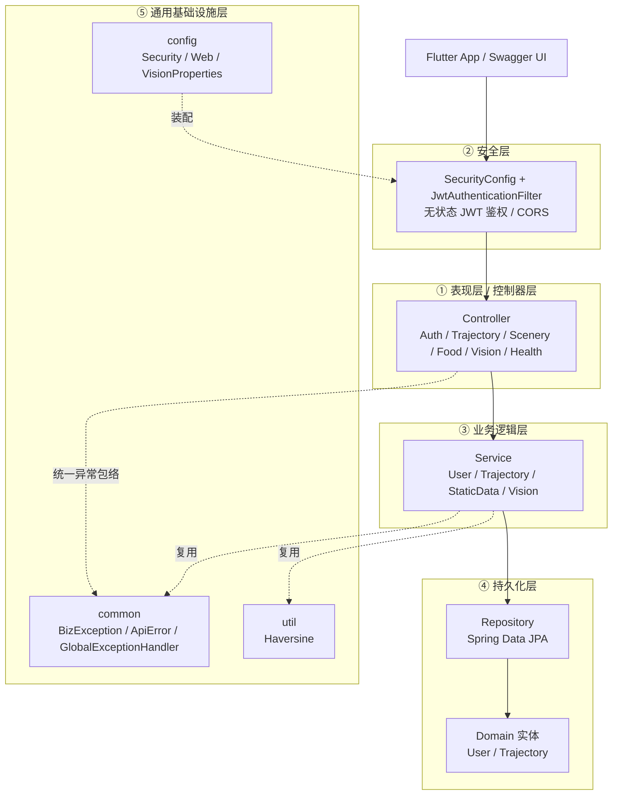
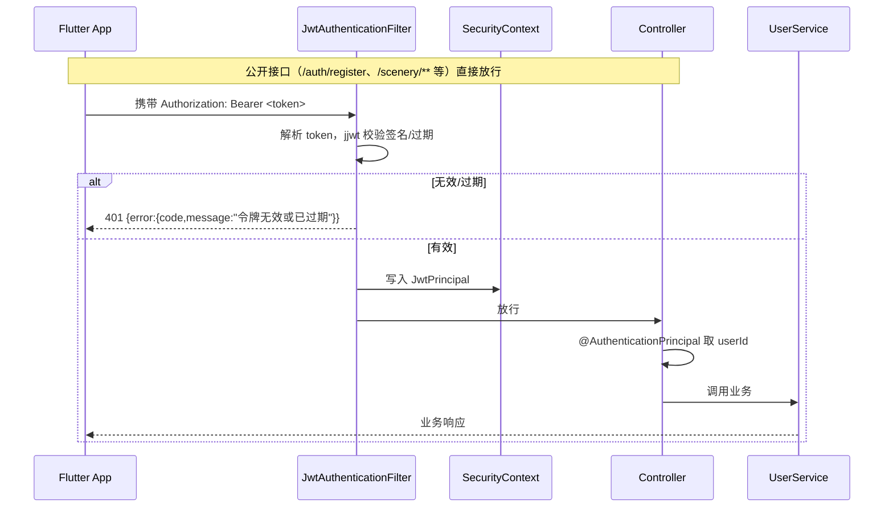
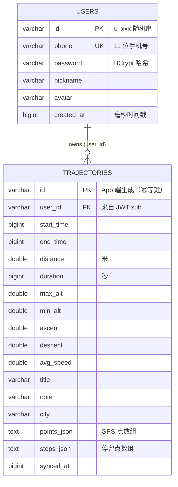
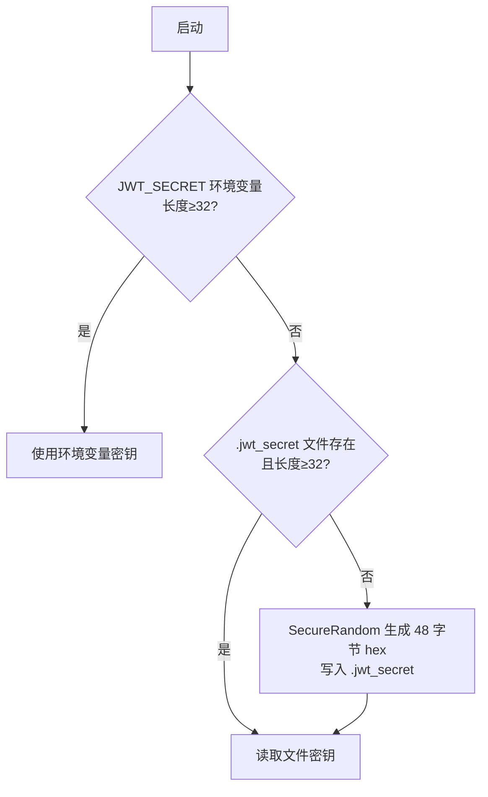
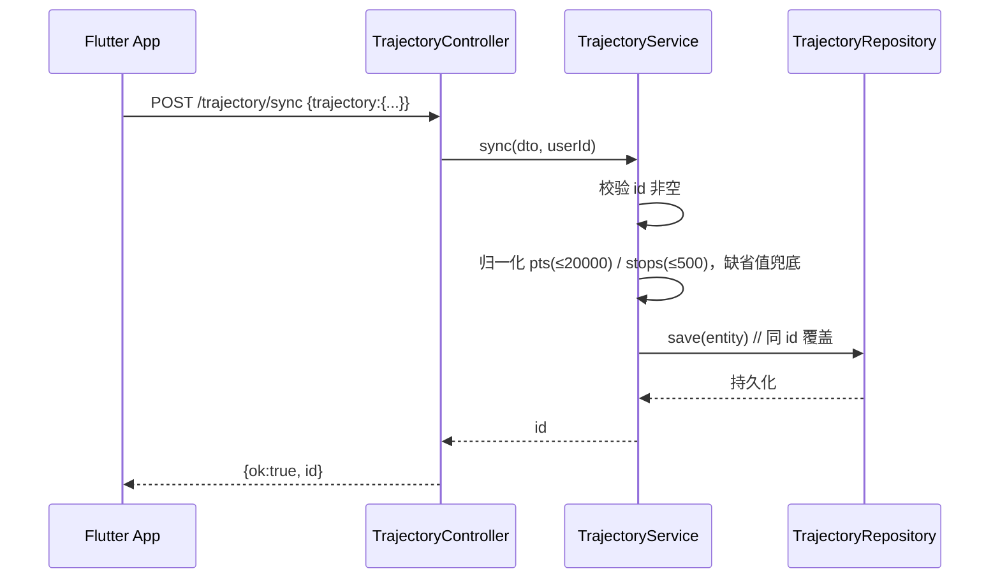

# 微旅途后端 · 架构设计文档（MicroTripServer · JavaWeb 重写版）

> 版本：v1.0 ｜ 适用工程：`MicroTripServerJava`（Spring Boot 3.3 + Java 21）
>
> 本文档面向**后端开发者、架构评审、运维部署**，系统描述微旅途（MicroTrip）后端服务的
> 总体架构、分层设计、数据模型、安全方案、关键流程与部署运维。
> 目标：**在不改动 Flutter 端任何代码的前提下，用 JavaWeb 最佳实践重写原 Node.js 后端，并保持对外 REST 契约完全一致。**

---

## 1. 文档概述

| 项 | 内容 |
|----|------|
| 系统名称 | 微旅途后端服务（MicroTripServer） |
| 重写目标 | 用 Spring Boot 3.3 + Java 21 替代原 Express 5 + node:sqlite 后端 |
| 关键约束 | **对外 REST 契约、字段命名、错误码、JWT payload、分页规则与原版完全一致**，Flutter 端 `AuthService` / `SyncService` 零改动对接 |
| 读者对象 | 后端开发、技术负责人、运维 |
| 文档范围 | 架构、分层、数据模型、安全、关键流程、配置部署、演进路线 |

---

## 2. 系统上下文（Context）

微旅途后端定位为 **BFF（Backend For Frontend）式轻量业务服务**：一端连接 Flutter 跨端 App，
一端对接可选的第三方 AI 云服务（腾讯云图像分析 tiia）。它不承担重负载计算，核心职责是
**账号鉴权、轨迹数据托管、城市静态数据下发、拍照识物推荐**。

```mermaid
flowchart LR
    App[Flutter 跨端 App\n(MicroTrip)]
    subgraph Backend[MicroTripServer · Spring Boot]
        API[REST API :3000]
    end
    subgraph External[外部依赖]
        DB[(H2 / MySQL)]
        TIIA[腾讯云 tiia\n图像分析]
    end
    App -- HTTPS / JSON --> API
    API --> DB
    API -. 未配置则 501 .-> TIIA
```

**关键关系说明：**

- **与 Flutter 端**：App 在「设置 → 账号与后端服务」填入 `http://<host>:3000`，登录/注册/轨迹同步自动切换真实后端；发现页（美食/景点）提供「模拟数据开关」，关闭且后端可用时拉取真实数据，失败自动降级本地 mock。**拍照识物无 mock**——未配置密钥时返回 501，不伪造结果。
- **与数据库**：默认文件型 H2（零外部依赖，开箱即用），生产可经 profile 切换 MySQL。
- **与第三方 AI**：`/vision/recognize` 通过 `VisionProvider` 抽象解耦，未配置密钥时由 `VisionService` 直接返回 501 `NOT_CONFIGURED`；配置后由 `TencentVisionProvider` 发起腾讯云 tiia `DetectLabel` 真实调用（TC3-HMAC-SHA256 签名）。

---

## 3. 总体架构（分层）

后端采用经典 **分层架构（Layered Architecture）**，自上而下分为 5 层，依赖方向严格单向（上层依赖下层抽象，下层不感知上层）：



**分层职责与依赖规则：**

| 层 | 包 | 职责 | 允许依赖 |
|----|----|------|----------|
| ① 表现层 | `controller` | HTTP 协议适配、参数绑定（`@Valid`）、响应封装、路由 | ③ 业务层、② 安全层（取 `@AuthenticationPrincipal`） |
| ② 安全层 | `security` | JWT 签发/校验、无状态过滤器链、CORS | 通用层 |
| ③ 业务层 | `service` | 核心业务逻辑、事务边界、领域规则 | ④ 持久化层、通用层、工具 |
| ④ 持久化层 | `repository` + `domain` | ORM 实体、数据访问抽象 | 仅 `domain` 自身 |
| ⑤ 通用/基础设施 | `common` / `config` / `util` | 异常、配置、数学工具，被各层复用 | 不反向依赖业务层 |

> **设计取舍**：未引入 `Controller → Service → Manager → DAO` 的 Manager 层。当前业务体量（单用户维度数据 + 静态数据）下，Service 直接调用 Repository 已足够清晰；若后续出现跨 Service 的复杂编排，可再抽出 `manager` 包，不改变现有分层。

---

## 4. 技术选型与版本

| 领域 | 选型 | 版本 / 说明 |
|------|------|------------|
| 语言 / 框架 | **Spring Boot + Java** | 3.3 / 21（LTS，虚拟线程就绪、Record、模式匹配） |
| 构建 | **Maven** | 父 POM 管理依赖版本，约定优于配置 |
| Web | `spring-boot-starter-web` | 内嵌 Tomcat，REST 控制器 |
| 参数校验 | `spring-boot-starter-validation` | Jakarta Bean Validation（`@Valid`） |
| 持久化 | `spring-boot-starter-data-jpa` | Spring Data JPA，Repository 抽象，零 SQL 样板 |
| 安全 | `spring-boot-starter-security` | 承载自定义 JWT 过滤器链（无状态） |
| 数据库 | **H2（文件型，默认）** / **MySQL（profile）** | 默认零外部依赖；生产切 MySQL |
| JWT | `jjwt` | 0.12.x，HS256，与 App 端 payload 对齐 |
| 密码哈希 | `BCryptPasswordEncoder` | cost 10，等价 Node 版 bcryptjs |
| 接口文档 | `springdoc-openapi` | 自动生成 Swagger UI（`/swagger-ui.html`） |
| 样板精简 | **Lombok** | `@Data` / `@Builder` 消除实体/DTO 样板 |
| 健康检查 | `spring-boot-starter-actuator` | `/actuator/health` 供编排系统探活 |

---

## 5. 包结构与目录

```
MicroTripServerJava/
├── pom.xml
├── README.md
├── .jwt_secret                  # 启动时生成并持久化的 JWT 密钥（自动）
├── src/main/
│   ├── java/com/microtrip/server/
│   │   ├── MicroTripServerApplication.java     # 启动类（排除 UserDetailsServiceAutoConfiguration）
│   │   ├── common/                             # ① 通用层
│   │   │   ├── ApiError.java                   #   统一错误体 {code,message}
│   │   │   ├── BizException.java               #   业务异常（携带 HTTP 状态/错误码）
│   │   │   └── GlobalExceptionHandler.java     #   @RestControllerAdvice 统一包络
│   │   ├── config/                             # ⑤ 装配
│   │   │   ├── SecurityConfig.java             #   无状态 JWT 过滤器链 + CORS
│   │   │   ├── WebConfig.java                  #   注册静态缓存拦截器
│   │   │   ├── StaticCacheInterceptor.java     #   food/scenery 只读缓存 5 分钟
│   │   │   └── VisionProperties.java           #   图像识别配置绑定
│   │   ├── security/                           # ② 安全层
│   │   │   ├── JwtPrincipal.java               #   认证主体（sub/name/phone）
│   │   │   ├── JwtUtil.java                    #   签发/校验（jjwt HS256）
│   │   │   ├── JwtSecretService.java           #   密钥解析 + 持久化
│   │   │   └── JwtAuthenticationFilter.java    #   OncePerRequestFilter
│   │   ├── domain/                             # ④ 实体
│   │   │   ├── User.java                       #   用户（手机号 + BCrypt）
│   │   │   └── Trajectory.java                 #   轨迹（GPS/停留点存 JSON）
│   │   ├── repository/                         # ④ 数据访问
│   │   │   ├── UserRepository.java
│   │   │   └── TrajectoryRepository.java
│   │   ├── dto/                                # 请求/响应模型（含字段兼容）
│   │   │   ├── AuthResponse / RegisterRequest / LoginRequest / UserDto
│   │   │   ├── TrajectorySyncRequest / TrajectorySyncDto / Trajectory*Dto
│   │   │   ├── FoodItem / SceneryItem / FoodShop / NearbyScenery
│   │   │   └── VisionLabel / VisionRequest / VisionResult
│   │   ├── service/                            # ③ 业务层
│   │   │   ├── UserService / TrajectoryService / StaticDataService
│   │   │   ├── VisionService / VisionProvider / TencentVisionProvider
│   │   │   └── (util/Haversine.java)           # 球面距离计算
│   │   └── controller/                         # ① 表现层
│   │       ├── HealthController / AuthController / TrajectoryController
│   │       ├── FoodController / SceneryController / VisionController
│   └── resources/
│       ├── application.yml                     # 默认 H2 配置
│       ├── application-mysql.yml               # MySQL profile
│       └── data/{food,scenery,shops}.json      # 城市静态数据集（搬自原 Node 版）
```

---

## 6. 请求处理主流程

### 6.1 鉴权流程（无状态 JWT）



**设计要点：**

- **无状态**：`SessionCreationPolicy.STATELESS`，不创建 HttpSession，天然适配移动端 + 横向扩展。
- **CSRF 关闭**：Bearer Token 已自携带，且非 Cookie 会话，无需 CSRF 防护。
- **双层 401**：① 无 `Authorization` 头访问受保护接口 → `AuthenticationEntryPoint` 返回 401；② 有头但失效 → `JwtAuthenticationFilter` 短路返回 401。两者包络结构一致。
- **CORS**：`allowCredentials=false` 配合 `allowedOrigin=*`（App 原生请求无 `Origin` 头，默认放行）；暴露 `Authorization` 头。

### 6.2 统一响应与错误包络

所有错误收敛为统一包络，**业务异常由 `@RestControllerAdvice` 处理，认证失败由 Security 层直接写出**，但结构一致：

```json
{ "error": { "code": "NOT_FOUND", "message": "轨迹不存在" } }
```

| 异常来源 | 处理位置 | HTTP 状态 | 典型 code |
|----------|----------|-----------|-----------|
| 业务规则（未注册/冲突/无配置） | `GlobalExceptionHandler` → `BizException` | 4xx / 501 | `ERROR` / `NOT_CONFIGURED` |
| `@Valid` 参数校验失败 | `MethodArgumentNotValidException` | 400 | `ERROR` |
| JSON 解析失败 | `HttpMessageNotReadableException` | 400 | `ERROR` |
| 方法不匹配（POST 调 DELETE 路由） | `HttpRequestMethodNotSupportedException` | 405 | `METHOD_NOT_ALLOWED` |
| 路径不存在（Spring 6） | `NoResourceFoundException` | 404 | `NOT_FOUND` |
| 未携带/失效令牌 | Security 层（不过 Advice） | 401 | `ERROR` |
| 兜底未知异常 | `Exception` | 500 | `ERROR`（不暴露细节） |

> 关键修正：Spring 6 中未匹配路径抛 `NoResourceFoundException`（非旧版 `NoHandlerFoundException`），且方法不匹配抛 `HttpRequestMethodNotSupportedException`，二者已分别映射为 404 / 405，**避免被兜底成 500 误导排查**。

---

## 7. 数据模型设计

### 7.1 ER 概览



### 7.2 实体设计要点

**User（用户账号）**
- 主键 `id` 为 **`u_` + 12 字节随机 hex**（非自增），避免自增 ID 泄露用户量。
- `phone` 唯一约束（`uk_users_phone`），作为登录标识。
- `password` 以 **BCrypt cost 10** 哈希存储，绝不明文。
- 时间字段统一 **毫秒时间戳**（与 App 端一致）。

**Trajectory（轨迹记录）**
- 主键 `id` 由 **App 端生成**，作为幂等 upsert 的键（断点重试安全）。
- `user_id` 来自 JWT `sub`，**所有读写均强制按 userId 过滤**，实现租户级数据隔离。
- GPS 点与停留点以 **JSON 文本**（`points_json` / `stops_json`）存储，避免拆多表关联，契合「整段轨迹整体读写」的访问模式。
- 上限保护：GPS 点 ≤ 20000、停留点 ≤ 500（超限截断），防止单条记录膨胀。
- 复合索引 `idx_trajectories_user_start(user_id, start_time DESC)` 加速「我的轨迹列表」分页查询。

### 7.3 静态数据（非数据库）

美食/景点/门店数据集以 **JSON 文件**置于 `classpath:data/`，`@PostConstruct` 启动时一次性加载进内存（`StaticDataService.load()`）。
- **优势**：城市静态数据变更无需改库，发布即更新；服务端持有，与 App 内置 mock 解耦。
- **`{city}` 占位符注入**：数据模板中如「{city}历史博物馆」在响应时按请求 `?city=` 渲染为真实城市名（`rep()` 方法）。
- **周边推荐**：`nearby/:id` 用 Haversine 球面距离公式（见 `util/Haversine`）计算真实距离，升序取前 4。

---

## 8. 安全设计

### 8.1 认证机制（JWT）

| 项 | 设计 |
|----|------|
| 算法 | HS256（jjwt 0.12.x），对称密钥 |
| 有效期 | 默认 **30 天**（`expires-in-seconds: 2592000`），与 App 端 `tokenTtl` 对齐 |
| Payload | `{ sub: userId, name: nickname, phone, iat, exp }` —— 与 App 端 `AuthService` 严格对齐 |
| 签发 | 注册/登录成功后 `JwtUtil.sign()` 生成 |
| 校验 | `JwtAuthenticationFilter` 在 `UsernamePasswordAuthenticationFilter` 之前拦截 |

### 8.2 密钥管理（`JwtSecretService`）

解析优先级（与 Node 版 `config.js` 一致）：



> 优先级：`JWT_SECRET` > `.jwt_secret` 文件 > 启动时随机生成并持久化。
> 保证**重启后已签发 token 仍可校验**（密钥持久化），同时兼容容器编排注入。

### 8.3 授权与数据隔离

- **公开接口**：`/health`、`/actuator/health`、`/auth/register`、`/auth/login`、`/scenery/**`、`/food/**`、Swagger 文档。
- **受保护接口**：`/auth/logout`、`/trajectory/**`、`/vision/**`（缺/无效令牌 → 401）。
- **数据隔离**：`/trajectory/*` 所有操作以 `principal.sub()` 作为 `userId` 过滤条件（`findByIdAndUserId`），**越权访问他人轨迹直接 404（不存在）**，不泄露「存在但无权限」信息。

### 8.4 密码安全

`BCryptPasswordEncoder(10)` 哈希；登录用 `encoder.matches()` 恒定时间比较，防时序攻击；绝不返回密码字段（`UserDto` 不含 password）。

---

## 9. 关键业务流程

### 9.1 注册 / 登录

1. 校验手机号（`^1\d{10}$`）、密码（≥6 位）、昵称非空。
2. 注册时查重（`existsByPhone`），冲突返回 409 `conflict`。
3. BCrypt 哈希密码，生成 `u_` 随机 ID，持久化。
4. `JwtUtil.sign()` 签发 token，返回 `{ token, user }`（注册 201，登录 200）。
5. 登出（`/auth/logout`）为**协议占位**——JWT 无状态，服务端不维护会话，由客户端丢弃 token。

### 9.2 轨迹同步（幂等 upsert）



- **幂等键 = App 端轨迹 id**：`repository.save()` 同主键自动覆盖，支持**断点重试、弱网重发**不产生重复记录。
- **字段对齐**：`distance/duration/ascent/descent/avgSpeed/start/end/pts/stops` 与 `TrajectoryRecord.toMap()` 严格一致。

### 9.3 列表分页与详情

- **列表**（`/trajectory/list`）：返回**摘要**（不含 `pts`），按 `start_time DESC`，分页参数 `page`（默认 1）/ `pageSize`（默认 20，**封顶 50**），响应含 `total` 与 `hasNext`。
- **详情**（`/trajectory/:id`）：返回**完整对象**（含 `pts`/`stops`），JSON 文本反序列化为 DTO 列表。

### 9.4 拍照识物推荐（Vision）

```mermaid
flowchart TD
    R[POST /vision/recognize\n{imageBase64, city}] --> V[VisionService.recognize]
    V --> C{provider.isConfigured?}
    C -- 否 --> N[抛出 501 NOT_CONFIGURED]
    C -- 是 --> P[provider.recognize → List<VisionLabel>]
    P --> S[对 scenery/food 逐条打分]
    S --> B[分类加权: 食物/建筑地标]
    B --> T[按总分降序取前 3]
    T --> RES[返回 {labels, matches:{scenery,food}}]
```

- **Provider 抽象**：`VisionProvider` 接口解耦第三方；默认 `TencentVisionProvider` **已实现腾讯云 tiia `DetectLabel` 真实调用**（TC3-HMAC-SHA256 签名，仅依赖 JDK `HttpClient`），未配置密钥时仍返回 501，配置后返回真实标签。
- **匹配算法**：标签名出现在名称/标签/描述中得 1 分；云端分类含「食物」对美食加权、含「建筑/场景/地标」对景点加权；按总分降序各取前 3，无命中返回空数组。与 Node 版规则完全一致。

---

## 10. 配置与部署

### 10.1 配置项（环境变量优先）

| 变量 | 默认 | 说明 |
|------|------|------|
| `PORT` | 3000 | 服务端口（`server.port`） |
| `JWT_SECRET` | 自动生成并写入 `.jwt_secret` | JWT 签名密钥（≥32 字符） |
| `CORS_ORIGIN` | `*` | 允许的跨域来源 |
| `VISION_SECRET_ID` / `VISION_SECRET_KEY` | 空 | 腾讯云 tiia 密钥；缺失则 `/vision/recognize` 返回 501 |
| `VISION_REGION` | `ap-guangzhou` | 腾讯云地域 |

### 10.2 运行方式

```bash
# 开发 / 直接运行
mvn spring-boot:run
# 默认监听 http://localhost:3000

# 打包运行（成品 jar 名为 micro-trip-server-boot.jar）
mvn clean package
java -jar target/micro-trip-server-boot.jar

# 切换到 MySQL（生产）
java -jar target/micro-trip-server-boot.jar --spring.profiles.active=mysql \
  -DDB_USERNAME=root -DDB_PASSWORD=****
```

### 10.3 数据源 Profile

- **默认（H2）**：`jdbc:h2:file:./data/microtrip;DB_CLOSE_DELAY=-1;AUTO_RECONNECT=TRUE`，`ddl-auto: update` 首次启动自动建表。
- **MySQL（profile）**：`application-mysql.yml` 覆盖数据源，`ddl-auto: update` 同样自动建表。

### 10.4 构建注意事项（Windows）

- **文件锁**：`repackage` 会将 `target/*.jar` 重命名为 `*.jar.original` 再生成 fat jar。若**已有后端实例运行并占用同名 jar**，Windows 无法重命名 → 报 `Unable to rename ... to ...original`。**解决**：先停旧 `java -jar` 进程再 `mvn package`。成品 `finalName` 设为 `micro-trip-server-boot`（与目录名区分），降低冲突概率。
- **H2 2.x 限制**：`AUTO_SERVER=TRUE` 与 `DB_CLOSE_ON_EXIT=FALSE` **不允许同时出现**，否则启动报 `Feature not supported`。当前配置使用 `DB_CLOSE_DELAY=-1` 规避。

---

## 11. 接口契约总表（与原 Node 版一一对应）

| 方法 | 路径 | 鉴权 | 说明 | 关键响应 |
|------|------|------|------|----------|
| GET | `/health` | 公开 | 健康检查 | `{status:"ok"}` |
| POST | `/auth/register` | 公开 | 注册 | 201 `{token,user}` |
| POST | `/auth/login` | 公开 | 登录 | 200 `{token,user}` |
| POST | `/auth/logout` | Bearer | 登出（占位） | `{ok:true}` |
| POST | `/trajectory/sync` | Bearer | 幂等 upsert | `{ok:true,id}` |
| GET | `/trajectory/list` | Bearer | 摘要分页 | `{list,page,pageSize,total,hasNext}` |
| GET | `/trajectory/:id` | Bearer | 完整详情 | `{trajectory:{...}}` |
| DELETE | `/trajectory/:id` | Bearer | 删除 | `{ok:true}` |
| GET | `/scenery/list` | 公开 | 景点列表 | `{list:[...]}` |
| GET | `/scenery/detail/:id` | 公开 | 景点详情 | `{item:{...}}` |
| GET | `/scenery/nearby/:id` | 公开 | 周边推荐 | `{list:[NearbyScenery]}` |
| GET | `/food/list` | 公开 | 美食列表 | `{list:[...]}` |
| GET | `/food/detail/:id` | 公开 | 美食详情 | `{item:{...}}` |
| GET | `/food/shops` | 公开 | 推荐门店 | `{list:[...]}` |
| POST | `/vision/recognize` | Bearer | 拍照识物 | `{labels, matches}`（未配置 → 501） |

> 统一错误包络：`{ "error": { "code": "...", "message": "..." } }`。
> 所有时间字段为**毫秒时间戳**；轨迹字段统一 `distance/duration/ascent/descent/avgSpeed`。

---

## 12. 与原 Node 版的主要差异

| 维度 | Node 版（Express 5 + node:sqlite） | Java 版（Spring Boot 3.3 + JPA） |
|------|-----------------------------------|----------------------------------|
| 语言/框架 | Express 5 + node:sqlite | Spring Boot 3.3 + Spring Data JPA |
| 数据库 | SQLite（node:sqlite） | H2 文件库（默认）/ MySQL（profile） |
| 路由 | 手动 `express.Router` | `@RestController` + 注解路由 |
| 鉴权 | 自写 `requireAuth` 中间件 | Spring Security 无状态 JWT 过滤器链 |
| 静态数据 | 运行时读 JSON 文件 | 启动时加载 classpath 资源（等价） |
| Vision | 腾讯云调用 | Provider 抽象 + 未配置即 501（已接入腾讯云 tiia `DetectLabel` 真实调用） |
| 类型安全 | JS 动态类型 | Java Record + `@Valid` 编译期/运行期双重校验 |
| 文档 | 无 | springdoc 自动 Swagger UI |

> **契约零变化**：所有对外 REST 路径、字段命名、错误码、JWT payload、分页规则均与原版保持一致，Flutter 端无需适配。

---

## 13. 扩展性设计（Extension Points）

| 扩展点 | 当前实现 | 演进方向 |
|--------|----------|----------|
| 数据库 | H2 / MySQL 双 profile | 接入读写分离、连接池调优（HikariCP 默认） |
| 图像识别 | `VisionProvider` 接口 + tencent/aliyun/baidu（按 `microtrip.vision.provider` 注入） | 增加本地轻量模型；多厂商级联兜底 |
| 静态数据 | classpath JSON | 迁移至 CMS / 对象存储，支持热更新；或加 Redis 缓存层 |
| 缓存 | `StaticCacheInterceptor` 仅 Cache-Control 头；`redis` profile 已用 Redis 承载 JWT 黑名单 | 静态数据服务端缓存复用 Redis |
| 部署 | 单体 fat jar | 容器化（Docker）+ K8s，actuator 探活接入编排 |
| 多端鉴权 | 仅手机号+密码 | 增加微信/Apple 第三方登录（OAuth2 / Spring Authorization Server） |
| 轨迹分析 | 基础统计 | 异步批处理、热力图、行程聚类（引入消息队列 + 计算服务） |

---

## 14. 后续演进建议

1. ✅ **已引入 Redis（revocation profile）**：JWT 黑名单 + 用户封禁，支持主动登出/封禁。
   `RevocationService` 提供 `InMemoryRevocationService`（默认，单实例）与 `RedisRevocationService`
   （`--spring.profiles.active=redis`，跨实例共享）双实现，吊销以 token 的 SHA-256 摘要为键（不改 JWT payload，契约零变化）。
2. ✅ **接口版本化（`v1`）**：所有业务接口同时暴露规范路径 `/api/v1/...`（`/api/v1/auth/login`、
   `/api/v1/trajectory/sync`、`/api/v1/admin/ban` 等）与历史裸路径，双 `@RequestMapping` 映射。
   历史路径保留以**兼容已发布 Flutter 端（零改动）**；新客户端建议用 `/api/v1`，为不兼容契约升级
   预留空间（未来 `/api/v2` 可独立演进）。`ApiContractTest` 已切换为 v1 路径并新增旧路径兼容用例。
3. ✅ **可观测性**：Actuator 暴露 `health / info / metrics / prometheus`；Micrometer 指标统一追加 `application="micro-trip-server"` 维度（多实例监控可区分）；日志默认普通文本，激活 `json` profile（`--spring.profiles.active=json`）输出 Logstash JSON 结构化日志，便于 ELK / Loki 集中采集。
4. ✅ **数据落库优化（`trajectory_points` 拆表）**：保留 `trajectories.points_json` 作为对外契约的
   **规范存储**（保证 Flutter 零改动），新增独立表 `trajectory_points`（`trajectory_id + seq + lat/lng/ts`
   等索引列）作为**查询优化副本**：同步时与 `points_json` 一起写入（先删后插，幂等），删除轨迹时按
   `trajectory_id` 级联清理；提供按经纬度矩形的区域内检索，支持超长轨迹的 Geo 围栏 / 密度统计，
   无需在应用层解析万级 JSON。`TrajectoryPointRepository` 提供 `countByTrajectoryId` /
   `findByTrajectoryIdOrderBySeqAsc` / 区域检索方法，集成测试已验证落库与级联删除。
5. ✅ **已补充集成测试**：`ApiContractTest` 15 用例覆盖鉴权/轨迹/识物/登出吊销/封禁/404/405，
   固化「Flutter 零改动」的回归保障（`@SpringBootTest` 随机端口 + 真实过滤链 + 内存 H2）。
6. ✅ **安全加固**：
   - **角色化封禁**（替代 `X-Admin-Token`）：`User.role` + JWT `role` 声明，过滤链注入 `ROLE_*` 权限；
     `AdminController` 方法级 `@PreAuthorize("hasRole('ADMIN')")`（已开启 `@EnableMethodSecurity`），
     普通用户调用管理接口返回 403；`AdminBootstrapService` 按配置启动注入管理员，生产建议由 IdP/OAuth2 授予 ADMIN。
   - **限流**：`RateLimitFilter`（固定窗口内存实现，默认作用于 `/auth/login`、`/auth/register` 及其 v1 路径）
     超阈值返回 **429**；多实例生产可换 Redis 令牌桶。`RateLimitTest` 已验证。
   - **HTTPS 强制**：`https` profile 下 `microtrip.security.require-https=true`，Security 链 `requiresSecure()`
     重定向 HTTP→HTTPS（依赖前置代理 `X-Forwarded-*`）；`application-https.yml` 提供 `server.ssl.*` 占位（密钥由 KMS 注入）。
   - **密钥托管 fail-fast**：`JWT_REQUIRE_EXTERNALIZED=true`（建议配合 `prod` profile）时若未通过
     `JWT_SECRET` 注入密钥则启动失败，强制外部化，避免把随机/文件密钥用于生产。

---

*文档基于 `MicroTripServerJava` 源码（2026-08）整理，与已交付的 `README.md` 互为补充：README 侧重「如何运行」，本文档侧重「为何这样设计」。*
