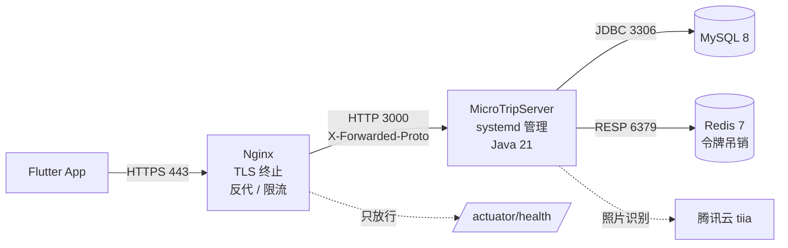
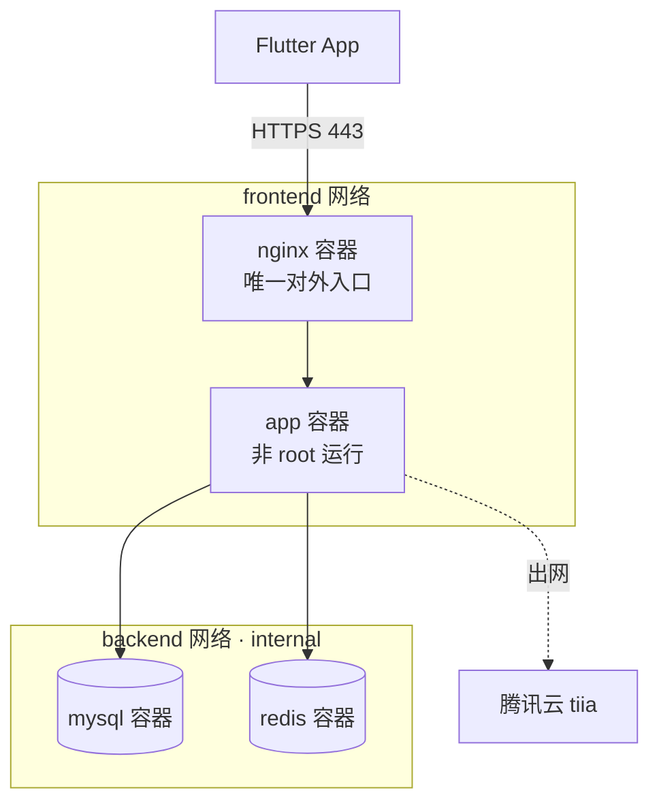

# 微旅途后端 · 部署指南

> 版本：v1.0 ｜ 适用工程：`MicroTripServerJava`（Spring Boot 3.3 + Java 21）
> 配套脚本目录：`scripts/` ｜ 部署资产目录：`deploy/`
>
> 本文覆盖三条路径：**本地开发环境搭建 → 本地部署（生产态验证）→ 服务器部署**，
> 以及配套的配置、运维、安全与排障手册。所有命令均在 Windows（Git Bash）与
> Linux 两种环境下验证过，跨平台差异处会明确标注。

---

## 1. 三条路径先分清

很多人把「跑起来」和「部署」混为一谈，结果在服务器上反复试错。本项目把运行状态分成三种，
配置与命令各不相同，先看清楚自己要走哪条：

| 路径 | 目的 | 数据源 | Profile | 入口命令 | 产物 |
|------|------|--------|---------|----------|------|
| **① 本地开发** | 改代码、调接口、写测试 | H2 文件库（默认，零依赖） | 无 / `mysql` / `mysql,redis` | `./scripts/dev.sh` | 无（`mvn spring-boot:run`） |
| **② 本地部署** | 上服务器前的终验：验证**生产参数**能起来 | H2 或 MySQL | `prod` / `prod,mysql,redis` | `./scripts/run-local.sh` | `target/micro-trip-server-boot.jar` |
| **③ 服务器部署** | 对外提供服务 | MySQL（必须） | `prod,mysql,redis,https` | `./scripts/deploy.sh` | jar + systemd，或 Docker 镜像 |

> **关键差异**：`prod` profile 下 `JWT_SECRET` 未注入会**直接拒绝启动**（fail-fast），
> 且默认强制 HTTPS。所以「开发能跑」不等于「生产能起」——路径 ② 就是专门拦这个坑的。

---

## 2. 部署拓扑

### 2.1 最简拓扑（单机 + systemd，推荐起步）



适用：个人项目、小规模内测。一台 2 核 4G 云主机足够。

### 2.2 容器拓扑（Docker Compose，推荐正式环境）



要点：
- **app 容器不映射宿主机端口**，唯一入口是 Nginx，杜绝绕过 TLS 直连 3000。
- **backend 网络标记 `internal: true`**，Nginx 不接这张网，即使 Nginx 被攻破也摸不到数据库。
- MySQL / Redis 数据卷与开发环境**独立命名**（`-prod` 后缀），防止误操作串数据。

---

## 3. 环境要求

### 3.1 开发机（本机 Windows / macOS / Linux）

| 组件 | 版本要求 | 本机安装命令（Windows + winget） | 说明 |
|------|----------|----------------------------------|------|
| JDK | **21+**（必须） | `winget install EclipseAdoptium.Temurin.21.JDK` | `pom.xml` 声明 `java.version=21`，17 编译不过 |
| Maven | 3.8+ | `winget install Apache.Maven` | Git Bash 下必须用 `mvn.cmd`（脚本已自动处理） |
| Docker Desktop | 可选 | `winget install Docker.DockerDesktop` | 仅「MySQL/Redis 开发容器」和「构建镜像」需要 |
| Git | 任意 | `winget install Git.Git` | 已含 Git Bash |
| openssl | 任意 | Git Bash 自带 | 生成 JWT 密钥与自签证书 |

> **零依赖也能开发**：默认 H2 文件库，不装 Docker、不装 MySQL 也能完整跑通全部接口。
>
> **本机不装 Docker 也能上 MySQL / Redis**：Windows 本地安装（winget + mysqld 初始化）
> 的完整步骤、Profile 矩阵（dev/test × mysql/redis/json/https）、日志滚动与监控、
> 备份与故障排查速查表，见 **《本地环境运维手册.md》**（2026-09-10 实机走通验证）。

### 3.1.1 环境 Profile 与能力 Profile（正交组合）

| Profile | 类型 | 作用 |
|---|---|---|
| `dev` | 环境 | 独立 H2 文件库 `data/microtrip-dev`；限流关闭；应用日志 DEBUG；允许随机 JWT 密钥 |
| `test` | 环境 | 独立 H2 文件库 `data/microtrip-test`；限流开启容量放宽 300；日志 INFO；不强制 HTTPS（App 常以 http:// 直连联调） |
| `prod` | 环境 | 强制外部化 JWT_SECRET / 数据库密码；强制 HTTPS |
| `mysql` / `redis` / `https` / `json` | 能力 | 数据源 / 令牌吊销 / TLS / 日志格式，与环境 profile 自由拼装（如 `test,mysql,redis`） |

一条命令自查：
```bash
./scripts/check-env.sh
```

### 3.2 服务器（Linux）

| 组件 | 版本要求 | 说明 |
|------|----------|------|
| 操作系统 | Ubuntu 22.04+ / Debian 12+ / CentOS Stream 9+ / Rocky 9+ | 需 systemd |
| JDK | **21**（jar 方式） | 推荐 Temurin 21（见 6.1） |
| Docker + Compose v2 | 24+（容器方式） | 官方脚本安装见 6.1 |
| MySQL | 8.0（外部托管或容器） | 需 `utf8mb4` 字符集 |
| Redis | 7（可选） | 多实例部署时**必须**，否则令牌吊销不跨实例共享 |
| Nginx | 1.24+（裸机方式） | 容器方式已内置 |
| 内存 / 磁盘 | 2G+ / 20G+ | 轨迹数据增长快，磁盘建议独立数据盘 |

---

## 4. 本地开发环境搭建

### 4.1 第一步：环境自检

```bash
cd MicroTripServerJava
./scripts/check-env.sh
```

输出示例（通过时）：

```
==> 微旅途后端 · 环境自检
1. JDK
 ✓ JDK 21（要求 ≥ 21）— java version "21.0.10" 2026-01-20 LTS
 ✓ JAVA_HOME=C:\Program Files\Java\jdk-21.0.10
2. Maven
 ✓ 使用命令：mvn.cmd
 ✓ MAVEN_HOME=C:\Program Files\apache-maven-3.9.9
3. Docker（可选：容器化部署 / MySQL 开发环境）
 ✓ Docker 29.4.3
 ! Docker 守护进程未运行
4. 端口占用
 ✓ 端口 3000 空闲
5. 配置文件
6. 项目结构
 ✓ pom.xml 与源码结构完整
==> 结论
 ✓ 必备环境检查通过，可以开始开发/部署
```

看到 ✗ 就按提示补装，不要带着问题往下走——后面报的错会离根因很远。

### 4.2 模式 A：零依赖启动（最常用）

```bash
./scripts/dev.sh
```

- 数据源：文件型 H2，落在 `./data/microtrip.mv.db`（已在 `.gitignore` 中）
- 监听：`http://localhost:3000`
- 接口文档：`http://localhost:3000/swagger-ui.html`
- 停止：`Ctrl + C`

首次启动会下载 Maven 依赖（约 3~5 分钟）；`check-env.sh` 会提示本地仓库是否已有缓存。

### 4.3 模式 B：MySQL + Redis（贴近生产）

**第 1 步**：起依赖容器
```bash
./scripts/infra.sh up
```
脚本会等到两个容器的健康检查都通过才返回（MySQL 首次初始化需 20~40 秒）。

默认凭据（可用 `.env` 覆盖）：

| 容器 | 端口 | 账号 / 密码 | 库 |
|------|------|-------------|-----|
| `microtrip-mysql` | 3306 | `microtrip` / `microtrip123`（root: `root123456`） | `microtrip` |
| `microtrip-redis` | 6379 | 无密码 | — |

**第 2 步**：以 MySQL 模式启动应用
```bash
./scripts/dev.sh mysql   # 只用 MySQL
./scripts/dev.sh full    # MySQL + Redis
```

**第 3 步**：验证数据真的落到了 MySQL
```bash
./scripts/infra.sh mysql
# 在 MySQL 提示符下：
#   USE microtrip;
#   SHOW TABLES;            -- 应看到 users / trajectories / trajectory_points
#   SELECT COUNT(*) FROM users;
```

**常用管理**
```bash
./scripts/infra.sh status        # 容器状态与健康检查
./scripts/infra.sh logs          # 跟踪日志
./scripts/infra.sh down          # 停止（保留数据）
./scripts/infra.sh reset --yes   # 停止并清空数据卷（⚠️ 数据丢失）
```

### 4.4 调试与热重启技巧

| 需求 | 做法 |
|------|------|
| 换端口（3000 被占） | `SERVER_PORT=3001 ./scripts/dev.sh` |
| 只跑 MySQL 不开 Redis | `./scripts/dev.sh mysql` |
| 用 IDE 断点调试 | 直接以 `MicroTripServerApplication` 为入口 Run/Debug，VM options 加 `-Dspring.profiles.active=mysql` |
| 看 SQL | 启动参数加 `--spring.jpa.show-sql=true --logging.level.org.hibernate.SQL=DEBUG`（**生产勿开**，日志会含手机号与 GPS 坐标） |
| 结构化日志 | 加 profile `json`：`./scripts/dev.sh` 后在 IDE 配置里追加 `json` |

### 4.5 跑测试

```bash
mvn test                       # 全量（62 用例）
mvn test -Dtest=ApiContractTest          # 接口契约（19 用例）
mvn test -Dtest=TrajectoryOptimizationTest   # 性能与新接口（13 用例）
mvn test -Dtest=IpAllowListTest          # Actuator 白名单纯逻辑（17 用例）
mvn test -Dtest=ActuatorAccessTest       # Actuator 访问控制端到端（12 用例）
mvn test -Dtest=RateLimitTest            # 限流（1 用例）
```

> 测试用嵌入式 H2，**不会**污染你的开发库，也不会连本地 MySQL。

---

## 5. 本地部署（生产态验证）

这一步跑的是**真实 jar + 生产 profile**，是上服务器前的最后一道关卡。

### 5.1 打包

```bash
./scripts/build.sh                 # 含全量测试（推荐）
./scripts/build.sh --skip-tests    # 跳过测试，快速出包
```

产物：`target/micro-trip-server-boot.jar`（约 60~70 MB，含全部依赖）。

> ⚠️ Windows 上如果 `mvn package` 报 `Unable to rename ... to ...original`，
> 说明有旧 `java -jar` 实例正占用该 jar。先 `./scripts/run-local.sh --stop` 或
> 任务管理器结束对应 java 进程，再重新打包。

### 5.2 以生产参数运行

```bash
./scripts/run-local.sh              # prod + H2
./scripts/run-local.sh mysql        # prod + MySQL
./scripts/run-local.sh full --bg    # prod + MySQL + Redis，后台运行
```

脚本会做三件你可能没想到但很关键的事：

1. **自动准备 `JWT_SECRET`**：`prod` profile 开启了 `require-externalized`，没密钥会拒绝启动。
   脚本从 `.jwt_secret` 读取；文件不存在就生成一份并落盘（已 gitignore）。
   这样多次本地重启之间已签发的令牌仍然有效，便于调试 App 登录态。
2. **关掉 HTTPS 强制**：本地没有证书，`REQUIRE_HTTPS` 会被强制为 `false`，
   否则所有请求被 301 到不存在的 https 端口。
3. **先等就绪再返回**：`--bg` 模式下轮询 `/actuator/health` 直到 `UP`，避免「以为起来了其实没起来」。

停止：`./scripts/run-local.sh --stop`（先发 SIGTERM 走优雅停机，超时才强杀）。

### 5.3 全链路冒烟测试

```bash
./scripts/health.sh                    # 本机 3000
./scripts/health.sh --port 3001
./scripts/health.sh --base https://api.example.com
./scripts/health.sh --quick            # 只探活
```

覆盖链路与断言：

| # | 检查项 | 期望 | 说明 |
|---|--------|------|------|
| 1 | `GET /actuator/health` | 200 `UP` | 失败即中止 |
| 2 | `POST /auth/register` | 200 且返回 token | 随机手机号，避免撞库 |
| 3 | 重复手机号注册 | 409 / 400 | 唯一约束是否生效 |
| 4 | 无令牌访问受保护接口 | 401 | 鉴权链是否真的在拦 |
| 5 | `POST /trajectory/sync` | 200 `ok:true` | 3 个 GPS 点 |
| 6 | 同 id 重复同步 | 200 | **幂等性** |
| 7 | `GET /trajectory/list` | 200，**响应不含 `pts`** | 投影查询是否退化（性能回归钉子） |
| 8 | `GET /trajectory/stats` | 200 | 聚合统计 |
| 9 | `GET /trajectory/{id}` | 200 含 `pts` | 详情契约 |
| 10 | `/scenery/list`、`/food/list` | 200 | 静态数据 |
| 11 | `DELETE /trajectory/{id}` | 200 | — |
| 12 | `POST /auth/logout` | 200 | — |
| 13 | **登出后旧令牌再用** | **401** | 吊销是否真的生效（安全钉子） |

第 7 与第 13 项是刻意加的「钉子用例」——它们断言的是**性能**与**安全**属性，
一旦有人重构时改坏，冒烟测试立刻报警。

---

## 6. 服务器部署

### 6.1 服务器首次初始化

以 Ubuntu 22.04 为例，**两种方式都需要的公共步骤**：

```bash
# ---------- 时区（轨迹时间是业务语义，务必对齐）----------
sudo timedatectl set-timezone Asia/Shanghai
date

# ---------- 单独的系统账号（禁止登录）----------
sudo useradd -r -s /usr/sbin/nologin -d /opt/microtrip microtrip

# ---------- 目录 ----------
sudo mkdir -p /opt/microtrip /var/log/microtrip /etc/microtrip
sudo chown -R microtrip:microtrip /opt/microtrip /var/log/microtrip
sudo chmod 750 /etc/microtrip

# ---------- 防火墙：只放行 SSH / HTTP / HTTPS ----------
sudo ufw allow 22/tcp
sudo ufw allow 80/tcp
sudo ufw allow 443/tcp
sudo ufw enable
sudo ufw status
# ⚠️ 不要放行 3000 / 3306 / 6379：应用只应通过 Nginx 访问，
#    数据库只应被应用所在机器访问。
```

**jar 方式额外安装 JDK 21**：
```bash
# Temurin 21（Adoptium 官方 apt 源）
sudo apt install -y wget apt-transport-https gpg
wget -qO - https://packages.adoptium.net/artifactory/api/gpg/key/public \
  | gpg --dearmor | sudo tee /etc/apt/keyrings/adoptium.gpg > /dev/null
echo "deb [signed-by=/etc/apt/keyrings/adoptium.gpg] \
  https://packages.adoptium.net/artifactory/deb $(awk -F= '/^VERSION_CODENAME/{print$2}' /etc/os-release) main" \
  | sudo tee /etc/apt/sources.list.d/adoptium.list
sudo apt update && sudo apt install -y temurin-21-jdk
java -version     # 应显示 21.x
```

**容器方式额外安装 Docker**：
```bash
curl -fsSL https://get.docker.com | sudo sh
sudo usermod -aG docker "$USER"     # 免 sudo，需重新登录生效
docker compose version              # 应为 v2.x
```

> 国内服务器若拉取镜像慢，配置 `/etc/docker/daemon.json` 加镜像加速器后
> `sudo systemctl restart docker`。

### 6.2 方式 A：jar + systemd（推荐单机）

**本机一条命令推完**：
```bash
./scripts/deploy.sh --host root@1.2.3.4 --dry-run   # 先干跑，只校验不改动
./scripts/deploy.sh --host root@1.2.3.4
```

脚本流程：校验 `.env` 密钥 → SSH 连通性与远端 JDK → Maven 打包 → 上传 jar（先传 `/tmp/app.jar.new`
再原子 `mv`，避免半包导致服务起不来）→ 同步 systemd 单元 → 重启并检查是否保持运行。

> **安全设计**：脚本**刻意不上传** `.env`（真实密钥不应留在本机部署流程里），
> 只上传 `deploy/systemd/micro-trip-server.env.example` 到 `/etc/microtrip/server.env.tpl`，
> 需要你在服务器上手工填真实值。

**服务器侧收尾**：
```bash
sudo cp /etc/microtrip/server.env.tpl /etc/microtrip/server.env
sudo vim /etc/microtrip/server.env      # 填 DB_PASSWORD / JWT_SECRET / MYSQL_* 等
sudo chmod 600 /etc/microtrip/server.env
sudo chown root:root /etc/microtrip/server.env

sudo systemctl daemon-reload
sudo systemctl enable --now micro-trip-server
sudo systemctl status micro-trip-server
```

生成密钥的正确姿势：
```bash
openssl rand -base64 48     # JWT_SECRET
openssl rand -base64 24     # DB_PASSWORD / REDIS_PASSWORD
```

**日常管理**：
```bash
sudo systemctl restart micro-trip-server
sudo systemctl stop micro-trip-server
sudo journalctl -u micro-trip-server -f              # 实时日志
sudo journalctl -u micro-trip-server --since "10 min ago"
```

systemd 单元（`deploy/systemd/micro-trip-server.service`）已内置的加固：

| 配置 | 作用 |
|------|------|
| `User=microtrip` + `nologin` | 服务被攻破也拿不到交互式 shell |
| `NoNewPrivileges` / `ProtectSystem=full` / `ProtectHome` | 系统目录与 home 只读，限制提权面 |
| `ReadWritePaths=/opt/microtrip/data /var/log/microtrip` | 仅这两个目录可写 |
| `KillSignal=SIGTERM` + `TimeoutStopSec=40` | 配合 `server.shutdown=graceful`，让在途轨迹同步写完再退出 |
| `MemoryMax=1500M` | 防内存泄漏拖垮宿主机 |
| `StartLimitBurst=5` / `StartLimitIntervalSec=300` | 配置写错时不会无限重启刷爆日志 |

### 6.3 方式 B：Docker Compose（推荐正式环境）

```bash
# ---------- 本机 ----------
./scripts/deploy.sh --host root@1.2.3.4 --mode docker
```

脚本会：构建镜像 → `docker save` 导出 → 上传镜像与编排文件 → 远端 `docker load` → `compose up -d`。

**服务器侧准备 `.env`（必须，否则 app 起不来）**：
```bash
ssh root@1.2.3.4
cd /opt/microtrip
cp .env.example .env
vim .env
#   必须填：
#     MYSQL_ROOT_PASSWORD / MYSQL_PASSWORD
#     DB_PASSWORD（与 MYSQL_PASSWORD 一致）
#     REDIS_PASSWORD
#     JWT_SECRET       ← openssl rand -base64 48
#     SPRING_PROFILES_ACTIVE=prod,mysql,redis
chmod 600 .env

# ---------- TLS 证书（必须先放好，否则 Nginx 容器起不来）----------
mkdir -p deploy/certs
# 把 fullchain.pem 与 privkey.pem 放进来，来源见 6.4
# ⚠️ 目录为空时 Nginx 会以 "cannot load certificate" 直接退出，
#    而应用容器已经被 depends_on 拉起 —— 表现为「进程都在跑，但网站打不开」。
ls -l deploy/certs/    # 确认两个文件都在，再做下一步

# ---------- 启动 ----------
docker compose -f docker-compose.prod.yml up -d
docker compose -f docker-compose.prod.yml ps
docker compose -f docker-compose.prod.yml logs -f app
```

> 编排里用了 `${VAR:?必须在 .env 中设置}` 语法：缺失关键变量时 compose 会**直接报错退出**，
> 而不是起一个连不上数据库的容器让你事后排查。这是刻意的。

**常用运维**：
```bash
docker compose -f docker-compose.prod.yml ps
docker compose -f docker-compose.prod.yml logs -f app --tail=200
docker compose -f docker-compose.prod.yml restart app
docker compose -f docker-compose.prod.yml up -d --no-build     # 仅重建变更的服务
docker compose -f docker-compose.prod.yml down                  # 停止（卷保留）
docker stats --no-stream                                        # 资源占用
```

### 6.4 TLS 证书

**生产（推荐）**：Let's Encrypt 免费颁发，需公网域名。

```bash
# 用 standalone 模式签发（80 端口需空闲，即先停 Nginx）
sudo apt install -y certbot
sudo systemctl stop nginx 2>/dev/null || true
sudo docker compose -f docker-compose.prod.yml stop nginx 2>/dev/null || true

sudo certbot certonly --standalone -d api.example.com \
  --agree-tos -m xuhaijun5382@163.com --no-eff-email

# 证书在 /etc/letsencrypt/live/api.example.com/
sudo mkdir -p deploy/certs
sudo cp /etc/letsencrypt/live/api.example.com/fullchain.pem deploy/certs/
sudo cp /etc/letsencrypt/live/api.example.com/privkey.pem deploy/certs/
sudo chmod 644 deploy/certs/*.pem

# 自动续期（certbot 已装 systemd timer，续期后需重新拷贝并 reload）
sudo certbot renew --dry-run
```

续期钩子（`/etc/letsencrypt/renewal-hooks/deploy/reload-nginx.sh`）：
```bash
#!/bin/sh
set -e
cd /opt/microtrip
cp /etc/letsencrypt/live/api.example.com/fullchain.pem deploy/certs/
cp /etc/letsencrypt/live/api.example.com/privkey.pem  deploy/certs/
docker compose -f docker-compose.prod.yml exec nginx nginx -s reload
```

**联调（仅测试）**：自签证书
```bash
./scripts/gen-self-signed-cert.sh api.example.com
```
> ⚠️ Android 客户端默认不信任自签证书，用自签只能验证链路通不通，不能作为上线方案。

### 6.5 Nginx 配置说明

配置文件：`deploy/nginx/micro-trip-server.conf`（容器方式自动挂载）。裸机部署时：

```bash
sudo cp deploy/nginx/micro-trip-server.conf /etc/nginx/conf.d/
sudo mkdir -p /etc/nginx/certs
sudo cp deploy/certs/*.pem /etc/nginx/certs/
# 把文件里的 upstream `app:3000` 改成 `127.0.0.1:3000`
sudo sed -i 's/server app:3000;/server 127.0.0.1:3000;/' /etc/nginx/conf.d/micro-trip-server.conf
sudo nginx -t && sudo systemctl reload nginx
```

几个**不写会出事**的关键项：

| 配置 | 为什么必须有 |
|------|--------------|
| `proxy_set_header X-Forwarded-Proto $scheme` | 缺此行 → 应用端 `require-https` 把所有请求判为非安全通道 → **无限 301 循环** |
| `client_max_body_size 20m` | 单条轨迹最多 2 万 GPS 点，默认 1M 会直接 413 |
| `proxy_read_timeout 120s` | 大轨迹批量写入耗时较久，默认 60s 可能超时 |
| `location /actuator/ { deny all; }` | 指标端点暴露 JVM/连接池/接口耗时，是攻击者的系统说明书 |
| `limit_req zone=login_zone` | 登录/注册接口单独收紧到 10 次/分钟，防撞库 |
| `gzip off` | 响应压缩由 Spring 完成（`server.compression`），Nginx 再压是重复劳动 |

验证：
```bash
sudo nginx -t
curl -k https://127.0.0.1/actuator/health
curl -I -k https://127.0.0.1/actuator/metrics     # 应返回 404
curl -I http://127.0.0.1/                        # 应 301 到 https
```

### 6.6 部署后验收

```bash
# 在任意能访问到服务的机器上（本机即可）
./scripts/health.sh --base https://api.example.com
```

对 App 打通：把 Flutter 端 `AuthService` 的 baseUrl 指向 `https://api.example.com/api/v1`，
重新安装 App 走一遍注册 → 记录轨迹 → 同步 → 列表查看。

---

## 7. 配置项参考

### 7.1 Profile 组合

| Profile | 作用 | 典型组合 |
|---------|------|----------|
| （不填） | H2 文件库 + 内存吊销 + 允许 HTTP | 本地零依赖开发 |
| `mysql` | 切 MySQL（主机/端口/库名/账号均可环境变量注入） | `mysql` |
| `redis` | 吊销服务换 Redis 实现，跨实例共享 | `mysql,redis` |
| `prod` | 优雅停机、Actuator 收敛、JWT fail-fast、默认强制 HTTPS | 见下 |
| `https` | 强制全站 HTTPS + 信任 `X-Forwarded-*` | 前置 Nginx 时用 |
| `json` | 控制台日志输出 Logstash JSON（不影响业务） | 接入 ELK/Loki 时追加 |

**生产推荐**：`SPRING_PROFILES_ACTIVE=prod,mysql,redis,https`

### 7.2 核心环境变量

完整清单见 `.env.example`。以下是最容易踩坑的几项：

| 变量 | 默认 | 生产必须设置 | 说明 |
|------|------|--------------|------|
| `SPRING_PROFILES_ACTIVE` | 空 | ✅ | 见上表 |
| `SERVER_PORT` | `3000` | — | App 端默认连 3000 |
| `JWT_SECRET` | 空 | ✅ **必填** | `prod` 下留空会拒绝启动；生成：`openssl rand -base64 48` |
| `DB_HOST` / `DB_PORT` / `DB_NAME` | `localhost` / `3306` / `microtrip` | ✅ | 容器编排下必须是**服务名**（`mysql`），不能写 localhost |
| `DB_USERNAME` / `DB_PASSWORD` | `root` / 空 | ✅ | 生产用独立业务账号，不要 root |
| `DB_POOL_MAX` | `20` | — | 满足 `副本数 × DB_POOL_MAX < MySQL max_connections` |
| `JPA_DDL_AUTO` | `update` | — | 首启 `update` 建表；稳定后建议改 `validate` |
| `REDIS_PASSWORD` | 空 | ✅（用 Redis 时） | 容器编排中缺失会直接报错退出 |
| `REQUIRE_HTTPS` | `false` | ✅ | 前置 Nginx 时 `true`；本地联调必须 `false` |
| `CORS_ORIGIN` | `*` | — | App 原生请求无 Origin；有 Web 端时改具体域名 |
| `ACTUATOR_ALLOW_LIST` | `127.0.0.1,::1` | 建议 | Actuator 指标端点（metrics/prometheus）的来源 IP 白名单，支持精确 IP 与 IPv4 CIDR；留空 = 谁都不放行 |
| `MGMT_ENDPOINTS` | `health,info,metrics,prometheus` | — | Actuator 暴露的端点集合 |
| `LOG_FILE` | `application.log` | ✅ | 裸机建议 `/var/log/microtrip/app.log`；容器 `/app/logs/app.log` |
| `TZ` / `-Duser.timezone` | — | ✅ | 不设会按 UTC 记账，日志与按天统计错位 8 小时 |

### 7.3 安全相关默认值的变化

本次部署改造顺带加固了一处：原先 `SecurityConfig` 中 `/actuator/**` 是 `permitAll`（便于探活），
而 `/actuator/metrics`、`/actuator/prometheus` 会暴露 JVM 堆、连接池等待数、各接口耗时分布。
现在改为**按来源 IP 收敛**（`IpAllowList`），三层防护：

1. **应用层（真正生效的一层）**：`SecurityConfig` 只对 `/actuator/health*`、`/actuator/info` 放行；
   其余 Actuator 路径仅允许 `ACTUATOR_ALLOW_LIST` 中的来源，默认仅本机回环。
   判定只看 `request.getRemoteAddr()`，**不读 `X-Forwarded-For`** —— 否则加个代理头就能冒充内网地址。
2. **入口层**：Nginx 只放行 `/actuator/health/**`，其余 `/actuator/` 一律 404。
3. **网络层**：容器编排中数据库/缓存所在网段标记 `internal`，应用端口不对宿主机暴露。

几个刻意的设计取舍：

- **空配置 = 谁都不放行**（fail-closed），而不是「空即全放行」——配置漏填应当表现为拒绝。
- **拒绝时不区分端点是否存在**：匹配模式覆盖整个 `/actuator/**`，外部访问真实端点与不存在端点
  得到的响应一致，攻击者无法据此枚举端点。
- **未用 `management.server.address`**：该属性要求同时自定义 `management.server.port` 才生效，
  同端口场景下写成什么都不做，容易造成「以为加固了」的错觉，因此不采用。

实测（prod profile，本机来源）：

| 端点 | 本机来源 | 外部来源 |
|------|----------|----------|
| `/actuator/health`、`/health/liveness`、`/health/readiness`、`/info` | 200 | 200（公开，探活需要） |
| `/actuator/metrics`、`/actuator/prometheus` | 200 | 拒绝（401/403，且与不存在端点响应一致） |
| `/actuator/<不存在>` | 404 | 拒绝（同上） |

---

## 8. 运维手册

### 8.1 日志

| 方式 | 位置 | 命令 |
|------|------|------|
| jar + systemd | journald + 文件 | `sudo journalctl -u micro-trip-server -f`；文件 `${LOG_FILE}` |
| 容器 | 挂载到宿主机 | `docker compose -f docker-compose.prod.yml logs -f app`；`./logs-app/app.log` |

文件日志按 **10MB × 按天** 滚动，保留 7 天（`logback-spring.xml`）。

想接入 ELK / Loki：追加 `json` profile，控制台即输出结构化日志（含 `app` 字段与 MDC 中的 `traceId`）。

### 8.2 监控

| 端点 | 用途 |
|------|------|
| `/actuator/health` | 整体健康（含 DB / Redis 依赖） |
| `/actuator/health/liveness` | 进程存活（**不含**依赖，Docker HEALTHCHECK 用的就是它） |
| `/actuator/health/readiness` | 就绪（依赖可用才 UP） |
| `/actuator/metrics` | Micrometer 指标列表（含 `http.server.requests`） |
| `/actuator/prometheus` | Prometheus 拉取格式，已带 `application="micro-trip-server"` 维度 |

建议告警阈值：

| 指标 | 阈值 | 含义 |
|------|------|------|
| `hikaricp_connections_pending` | > 0 持续 1 分钟 | 连接池排队，需要调大 `DB_POOL_MAX` 或查慢 SQL |
| `http_server_requests_seconds` P99 | > 2s | 接口变慢，优先看轨迹详情/批量同步 |
| `jvm_memory_used_bytes` / `heap` | > 85% | 接近 OOM |
| `/actuator/health` | 非 UP | 依赖异常 |

> 为什么 liveness 与 readiness 要分开：liveness 探测依赖的话，数据库抖动会引发容器被反复重启，
> 把「数据库慢」升级成「服务不可用」。这是编排里最常见的自伤配置。

### 8.3 备份与恢复

```bash
./scripts/backup.sh                 # 备份本地 MySQL 容器
./scripts/backup.sh --keep 14       # 保留 14 份
./scripts/backup.sh --h2            # 备份 H2 文件库
```

脚本用 `mysqldump --single-transaction` 取**一致性快照**且不锁表——直接拷 `.ibd` 文件在写入过程中
会拿到半个事务，恢复后可能出现「轨迹在、GPS 点不见」这类静默数据错误。

加计划任务：
```bash
crontab -e
0 3 * * * cd /opt/microtrip && ./scripts/backup.sh --keep 14 >> logs/backup.log 2>&1
```

恢复：
```bash
gunzip -c backups/microtrip-mysql_20260910_030000.sql.gz \
  | docker exec -i microtrip-mysql mysql -umicrotrip -p'***' microtrip
```

> **备份必须验证**：定期在测试库上恢复一次。没恢复过的备份等于没有备份。

### 8.4 升级与回滚

**jar 方式**
```bash
# 升级（本机）
./scripts/deploy.sh --host root@1.2.3.4
# 回滚：服务器上保留上一版
sudo cp /opt/microtrip/app.jar /opt/microtrip/app.jar.bak   # 升级前先备份
sudo mv /opt/microtrip/app.jar.bak /opt/microtrip/app.jar
sudo systemctl restart micro-trip-server
```

**容器方式**
```bash
docker compose -f docker-compose.prod.yml up -d --no-build
# 回滚：改用上一个 tag
docker tag micro-trip-server:1.0.0 micro-trip-server:1.0.1
```

> 优雅停机（`server.shutdown=graceful` + `TimeoutStopSec=40`）保证升级重启时，
> 正在同步的轨迹会写完再退出，客户端不会看到连接重置。

**数据库结构变更**：当前用 `ddl-auto=update`（Hibernate 自动加列，**不会删列/改类型**）。
涉及删列、改类型等破坏性变更时，必须改用显式迁移脚本（Flyway/Liquibase），
或手工执行 DDL 后把 `JPA_DDL_AUTO` 设为 `validate`。

### 8.5 数据清理

轨迹数据是主要增长源，`trajectory_points` 表行数 ≈ 所有轨迹的 GPS 点数总和。

```sql
-- 查看占用
SELECT table_name, table_rows,
       ROUND(data_length/1024/1024, 2) AS data_mb,
       ROUND(index_length/1024/1024, 2) AS idx_mb
FROM information_schema.tables
WHERE table_schema='microtrip' ORDER BY data_mb DESC;
```

删除轨迹务必走接口（`DELETE /trajectory/{id}`），因为服务端在一个事务里同时清理
`trajectories` 与 `trajectory_points`；直接删主表会留下孤儿点行。

---

## 9. 安全清单（上线前逐项打勾）

- [ ] `JWT_SECRET` 通过环境变量注入，**不是**随机生成（多副本必须一致，且重启不掉线）
- [ ] 密钥文件权限 `600` 且属主 `root`（`/etc/microtrip/server.env` 或 `.env`）
- [ ] `.env`、`.jwt_secret`、`*.pem`、`data/` **未提交**到 Git（`.gitignore` + `.dockerignore` 已覆盖）
- [ ] 数据库使用**独立业务账号**，非 root，且只授权 `microtrip` 库
- [ ] 数据库、Redis、应用端口（3000/3306/6379）**不对公网开放**，防火墙只放行 22/80/443
- [ ] `REQUIRE_HTTPS=true` 且 Nginx 正确转发 `X-Forwarded-Proto`
- [ ] 使用**正式 TLS 证书**（非自签），`certbot renew --dry-run` 通过
- [ ] `/actuator/metrics` 与 `/actuator/prometheus` 外部不可访问（`ACTUATOR_ALLOW_LIST` 未包含
      外部网段，从未写成 `0.0.0.0/0`；Nginx 侧同时拦截 `/actuator/`）
- [ ] 实测验证过：从外部 IP 请求 `/actuator/prometheus` 被拒（不能只看配置就认为生效）
- [ ] Swagger UI（`/swagger-ui.html`、`/v3/api-docs`）在生产**已关闭**
- [ ] `CORS_ORIGIN` 按需收窄，不是 `*`（若有 Web 端）
- [ ] `ddl-auto` 在结构稳定后改为 `validate`
- [ ] 数据库备份任务已配置且**已实际验证过恢复**
- [ ] 登录/注册限流生效（`RATELIMIT_ENABLED=true`）且 Nginx 层同时限流
- [ ] 日志级别为 `INFO`，未开 `DEBUG`（避免手机号/GPS 进日志）
- [ ] 管理员账号通过 `ADMIN_BOOTSTRAP_*` 创建后，**已从配置中移除**引导密码

---

## 10. 排障 FAQ

### 启动失败

**`未通过 JWT_SECRET 注入密钥，拒绝启动`**
预期行为（`prod` profile 的 fail-fast）。生成并注入：
```bash
openssl rand -base64 48     # 写入 .env 或 /etc/microtrip/server.env 的 JWT_SECRET
```

**`Connection refused` / `Communications link failure`（连 MySQL）**
```bash
# 容器方式：确认容器健康
docker compose -f docker-compose.prod.yml ps
# 常见原因 1：DB_HOST 写了 localhost（容器内 localhost 指自己）
# 常见原因 2：MySQL 还没初始化完就启动了 app（编排已用 service_healthy 规避）
```

**`Table 'microtrip.users' doesn't exist`**
首次启动需要建表权限。确认 `JPA_DDL_AUTO=update`（或手工执行建表 DDL 后改 `validate`）。

**`Feature not supported: "AUTO_SERVER=TRUE && DB_CLOSE_ON_EXIT=FALSE"`**
H2 2.x 不允许两者同时出现。用默认的 `DB_CLOSE_DELAY=-1` 即可，不要额外加。

### 运行期异常

**所有请求被 301 到 https，或 `ERR_TOO_MANY_REDIRECTS`**
Nginx 少了 `proxy_set_header X-Forwarded-Proto $scheme;`。补上并 `nginx -s reload`。

**本地开发请求被重定向到 https**
本地没有证书却带了 HTTPS 强制。用 `./scripts/run-local.sh`（会自动关掉），
或检查 `.env` 里的 `REQUIRE_HTTPS`。

**`413 Request Entity Too Large`（同步大轨迹）**
Nginx 的 `client_max_body_size` 太小。生产配置已设 `20m`；若单条轨迹点数超过上限，
需要同步调大 Nginx、Tomcat（`max-http-form-post-size`）与 App 端分片策略。

**`429 Too Many Requests`**
限流触发。开发期可临时 `RATELIMIT_ENABLED=false`；生产应调 `RATELIMIT_CAPACITY` 而非关掉。

**轨迹同步很慢**
```bash
# 确认批量写入生效（MySQL 侧）
#   rewriteBatchedStatements=true 必须在 JDBC URL 里
#   hibernate.jdbc.batch_size=500
# 实测参考：5000 个 GPS 点，batch 500 → 645ms，batch 1 → 880ms（本机 H2）
```
若用的是 MySQL，漏掉 `rewriteBatchedStatements=true` 会让批量优化**完全失效**（驱动逐条发送）。

**内存持续增长 / 容器被 OOM Kill**
```bash
# jar 方式：确认 MemoryMax 与 -XX:MaxRAMPercentage 匹配
systemctl show micro-trip-server -p MemoryMax
# 容器方式：限制容器内存
docker stats --no-stream
```
`-XX:+ExitOnOutOfMemoryError` 会让进程主动退出并由重启策略拉起，比僵死更可控。

### 测试相关

**`@SpringBootTest` 里 `/actuator/prometheus` 返回 404，但启动真实服务是 200**
不是 bug。Spring Boot 的测试支持会向环境注入一个名为 `test` 的属性源：

```
management.defaults.metrics.export.enabled = false
management.simple.metrics.export.enabled  = true
management.tracing.enabled                = false
```

即**框架刻意在 `@SpringBootTest` 中关闭所有非 simple 的指标导出器**（避免测试把指标推送到
Prometheus 等外部系统）。副作用是 `PrometheusMeterRegistry` 不创建，
`/actuator/prometheus` 端点也就不会注册。要在测试里验证该端点的访问控制，
必须在 `@TestPropertySource` 中显式加上 `management.prometheus.metrics.export.enabled=true`
（`ActuatorAccessTest` 就是这么做的，注释里有完整说明）。
> 排查心得：这个属性在 `application.yml` 里搜不到、在环境变量里也没有，
> 只能用条件报告（`--debug` / `debug=true`）配合遍历 `PropertySources` 才能定位到来源。

### 接口调用相关

**`GET /scenery/list?city=成都` 返回 400（真实服务也一样）**
Tomcat 对请求目标里的非 ASCII 字符会报 `Invalid character found in the request target`。
中文查询参数**必须 URL 编码**：
```bash
curl -G --data-urlencode "city=成都" http://127.0.0.1:3000/api/v1/scenery/list
```
`scripts/health.sh` 里的 `req_q()` 已封装这一点。App 端用 Dio 时查询参数会自动编码，不受影响。

**本机 curl 访问 `127.0.0.1` 得到 502，但服务明明是好的**
本机环境注入了 `http_proxy`，代理会连 127.0.0.1 的请求也转发出去并返回 502。
加 `--noproxy '*'` 即可；脚本里的 `http_get()` 与 `health.sh` 已对回环地址自动绕过代理。

### 部署脚本相关

**`SSH 连接失败`**
```bash
ssh-copy-id -p 22 root@1.2.3.4      # 配置免密
ssh -o Port=2222 root@1.2.3.4 'echo ok'   # 非 22 端口要显式指定
```

**`Unable to rename ... to ...original`（Windows 打包）**
旧 `java -jar` 进程占用 jar。`./scripts/run-local.sh --stop` 后重试。

**Git Bash 下 `mvn` 报 `找不到或无法加载主类 Launcher`**
sh 版 mvn 的路径问题。用 `mvn.cmd`，或直接用 `./scripts/*.sh`（内部已自动选择）。

**`mvn compile` 报「不支持发行版本 21」**
机器上装了多个 JDK，`JAVA_HOME` 指到了低版本（本机同时有 `jdk-18.0.1.1` 与 `jdk-21.0.10`）。
注意 `PATH` 上的 `java` 与 Maven 实际使用的 JDK **可以不是同一个**：Maven 认的是 `JAVA_HOME`。
```bash
./scripts/check-env.sh    # 会同时报告 PATH 上的 java 与 JAVA_HOME 指向的 JDK 版本
```
脚本已按「版本号最高者优先」自动挑选（不能按字母序，`jdk-18` 会排在 `jdk-21` 前面），
若仍报错请手工 `export JAVA_HOME='<JDK 21 路径>'`。

---

## 11. 附：脚本速查

| 脚本 | 用途 | 常用命令 |
|------|------|----------|
| `scripts/_common.sh` | 公共库（被其他脚本 source） | 跨平台路径/Maven 解析、JDK 版本校验、端口探测、.env 读取、密钥生成 |
| `scripts/check-env.sh` | 环境自检 | `./scripts/check-env.sh` |
| `scripts/dev.sh` | 本地开发启动 | `./scripts/dev.sh [h2\|mysql\|full]` |
| `scripts/infra.sh` | MySQL/Redis 容器管理 | `./scripts/infra.sh up\|status\|logs\|down\|mysql\|redis` |
| `scripts/build.sh` | 打包 / 构建镜像 | `./scripts/build.sh [--skip-tests] [--docker]` |
| `scripts/run-local.sh` | 本地生产态运行 | `./scripts/run-local.sh [h2\|mysql\|full] [--bg\|--stop]` |
| `scripts/health.sh` | 健康检查 + 冒烟 | `./scripts/health.sh [--base URL] [--quick]` |
| `scripts/deploy.sh` | 部署到服务器 | `./scripts/deploy.sh --host user@ip [--mode jar\|docker] [--dry-run]` |
| `scripts/backup.sh` | 数据库备份 | `./scripts/backup.sh [--h2] [--keep N]` |
| `scripts/gen-self-signed-cert.sh` | 自签证书（联调用） | `./scripts/gen-self-signed-cert.sh [域名]` |

### 部署资产

| 文件 | 用途 |
|------|------|
| `Dockerfile` | 多阶段构建（Maven 构建 → JRE alpine 运行，非 root） |
| `.dockerignore` | 排除 target/密钥/本地数据，防止密钥进入镜像层 |
| `docker-compose.yml` | 本地开发依赖（MySQL + Redis） |
| `docker-compose.prod.yml` | 生产全栈（Nginx + app + MySQL + Redis，双网络隔离） |
| `deploy/nginx/micro-trip-server.conf` | Nginx 反代 + TLS + 限流 + Actuator 收敛 |
| `deploy/systemd/micro-trip-server.service` | systemd 单元（沙箱加固 + 优雅停机） |
| `deploy/systemd/micro-trip-server.env.example` | 服务器环境变量模板 |
| `.env.example` | 全量环境变量清单 |
| `src/main/resources/application-prod.yml` | 生产 profile（优雅停机 / Actuator 收敛 / fail-fast） |
